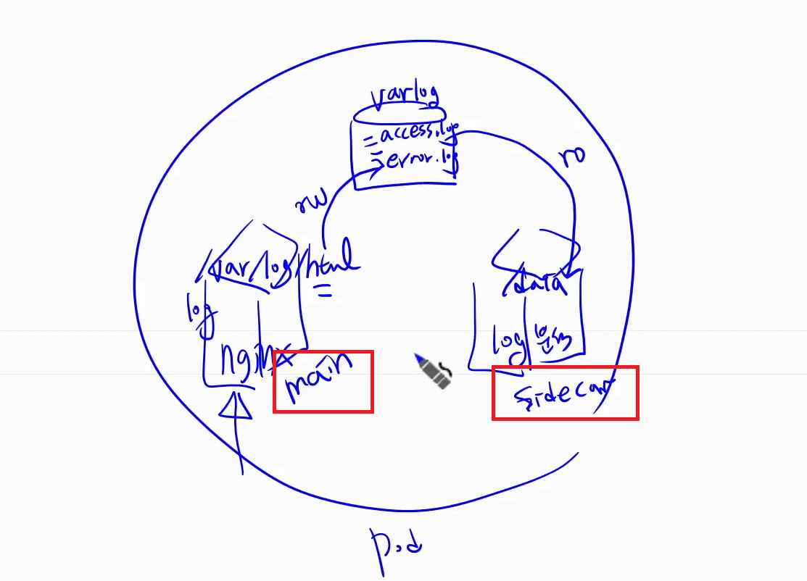

# cka-practice
- 인터넷 Youtube 이성미 강사님의 따배씨의 내용을 정리한 것임
  - https://www.youtube.com/playlist?list=PLApuRlvrZKojqx9-wIvWP3MPtgy2B372f
- Certified Kubernetes Admin Study
- K8S Documentation
  - https://kubernetes.io/docs/home/
## 외부 시스템에서 K8S Cluster 접근하기
- K8S Documentation > ``access multiple cluster`` 검색 > ``다중 클러스터 접근 구성 | Kubernetes`` 선택
  - https://kubernetes.io/ko/docs/tasks/access-application-cluster/configure-access-multiple-clusters/
  - Step 01: 외부 시스템에 kubectl 설치하기
    - https://kubernetes.io/ko/docs/tasks/tools/install-kubectl-linux/
  - Step 02: TODO
* * *  
# 01 ETCD Backup & Restore
## 검색 방법
- 검색어: ``etcd backup restore``
  - ``Operating etcd clusters for Kubernetes | Kubernetes`` 선택
  - https://kubernetes.io/docs/tasks/administer-cluster/configure-upgrade-etcd/#backing-up-an-etcd-cluster
## Problem: etcd backup & restore
- 작업 시스템: k8s-master   
  First, create a snapshot of the existing ``etcd`` instance running at ``http://127.0.0.1:2379``, saving the snapshot to ``/data/etcd-snapshot.db``. Next, restore an existing, previous snapshot located at ``/data/etcd-snapshot-previous.db``.      
   
  The following TLS ``certificates/key`` are supplied for connecting to the server with etcdctl:
    - CA certificate: ``/etc/kubernetes/pki/etcd/ca/ca.crt``
    - Client certificate: ``/etc/kubernetes/pki/etcd/server.crt``
    - Client key: ``/etc/kubernetes/pki/etcd/server.key``
## ETCD Backup과 Restore에 대한 소개
- ETCD
  - API에 의해서 동작되는 K8S의 모든 운영 정보가 담겨져 있는 저장소 역할
    - ``Key:Value`` 타입의 저장소
  - 하나의 Pod 형태로 동작되고 있음
  - 실제로는 메모리 공간에서 동작하지만, ``/var/lib/etcd``에 데이터베이스 형태로 함께 저장
- ETCD Backup
  - 현재의 ETCD 정보를 Snapshot을 만드는 개념
  - 예: ``/data/etcd-snapshot.db``
- ETCD Restore
  - 저장된 ETCD Snapshot을 이용해서 Restore
    - Step01: 저장된 ETCD Snapshot 파일(예:``/data/etcd-snapshot-previous.db``)을 ``/var/lib/etcd``이 아닌 다른 경로에 풀어줌      
    - Step02: K8S cluster가 새로운 경로의 ETCD를 바라볼 수 있도록 ``Configuration``을 변경
    - Step03: ETCD Pod는 Static Pod이므로, ``Configuration``을 변경하면 Auto Restart
- ETCD Backup & Restore Diagram   
  
## Answer
```bash
# Step 01: 작업 시스템에 접속
$ ssh k8s-master
# Step 02: 현재의 K8S current context 정보 얻기
$ kubectl config get-contexts
CURRENT   NAME                          CLUSTER      AUTHINFO           NAMESPACE
*         example@kubernetes            kubernetes   kubernetes-admin   product
          ingress-admin@kubernetes      kubernetes   kubernetes-admin   ingress-nginx
          kubernetes-admin@kubernetes   kubernetes   kubernetes-admin   default
$ kubectl config current-context
example@kubernetes
# Step 03: tree 명령어를 이용해 디렉토리 구조를 Display
$ sudo tree /var/lib/etcd
/var/lib/etcd
└── member
    ├── snap
    │   ├── 0000000000000032-000000000007a152.snap
    │   ├── 0000000000000033-000000000007c863.snap
    │   ├── 0000000000000033-000000000007ef74.snap
    │   ├── 0000000000000034-0000000000081685.snap
    │   ├── 0000000000000034-0000000000083d96.snap
    │   └── db
    └── wal
        ├── 0000000000000002-000000000002c07d.wal
        ├── 0000000000000003-0000000000041ac1.wal
        ├── 0000000000000004-0000000000056427.wal
        ├── 0000000000000005-000000000006cab3.wal
        ├── 0000000000000006-0000000000082c74.wal
        └── 1.tmp

3 directories, 12 files
# Step 04: etcdctl 설치 (없다면)
$ wget https://github.com/etcd-io/etcd/releases/download/v3.5.4/etcd-v3.5.4-linux-amd64.tar.gz
$ tar -zxvf etcd-v3.5.4-linux-amd64.tar.gz
$ cd etcd-v3.5.4-linux-amd64/
~/etcd-v3.5.4-linux-amd64$ sudo mv etcd  etcdctl  etcdutl /usr/local/bin
$ etcdctl version
etcdctl version: 3.5.4
API version: 3.5
# Step 05: Snapshot using etcdctl options
$ ETCDCTL_API=3 sudo etcdctl --endpoints=https://127.0.0.1:2379   --cacert=/etc/kubernetes/pki/etcd/ca.crt   --cert=/etc/kubernetes/pki/etcd/server.crt   --key=/etc/kubernetes/pki/etcd/server.key   snapshot save /data/etcd-snapshot.db
{"level":"info","ts":1661681002.3225548,"caller":"snapshot/v3_snapshot.go:119","msg":"created temporary db file","path":"/data/etcd-snapshot.db.part"}
{"level":"info","ts":"2022-08-28T19:03:22.330+0900","caller":"clientv3/maintenance.go:200","msg":"opened snapshot stream; downloading"}
{"level":"info","ts":1661681002.3307705,"caller":"snapshot/v3_snapshot.go:127","msg":"fetching snapshot","endpoint":"https://127.0.0.1:2379"}
{"level":"info","ts":"2022-08-28T19:03:22.397+0900","caller":"clientv3/maintenance.go:208","msg":"completed snapshot read; closing"}
{"level":"info","ts":1661681002.4073474,"caller":"snapshot/v3_snapshot.go:142","msg":"fetched snapshot","endpoint":"https://127.0.0.1:2379","size":"4.8 MB","took":0.08449835}
{"level":"info","ts":1661681002.40754,"caller":"snapshot/v3_snapshot.go:152","msg":"saved","path":"/data/etcd-snapshot.db"}
Snapshot saved at /data/etcd-snapshot.db
$ ll /data/etcd-snapshot.db
-rw------- 1 root root 4808736  8월 28 19:03 /data/etcd-snapshot.db
# Step 05-1: 테스트를 위해 새로운 Pod 생성
$ kubectl run testpod --image=nginx
pod/testpod created
$ kubectl get pods
NAME                          READY   STATUS              RESTARTS       AGE
testpod                       0/1     ContainerCreating   0              4s
# Step 06: Restoring an etcd cluster
#  - /data/etcd-snapshot-previous.db을 읽어서 /var/lib/etcd-previous에 압축을 품
$ sudo cp /data/etcd-snapshot.db /data/etcd-snapshot-previous.db
$ ETCDCTL_API=3 sudo etcdctl --data-dir /var/lib/etcd-previous snapshot restore /data/etcd-snapshot-previous.db
{"level":"info","ts":1661681885.7301135,"caller":"snapshot/v3_snapshot.go:296","msg":"restoring snapshot","path":"/data/etcd-snapshot-previous.db","wal-dir":"/var/lib/etcd-previous/member/wal","data-dir":"/var/lib/etcd-previous","snap-dir":"/var/lib/etcd-previous/member/snap"}
{"level":"info","ts":1661681885.7666476,"caller":"mvcc/kvstore.go:388","msg":"restored last compact revision","meta-bucket-name":"meta","meta-bucket-name-key":"finishedCompactRev","restored-compact-revision":477763}
{"level":"info","ts":1661681885.775317,"caller":"membership/cluster.go:392","msg":"added member","cluster-id":"cdf818194e3a8c32","local-member-id":"0","added-peer-id":"8e9e05c52164694d","added-peer-peer-urls":["http://localhost:2380"]}
{"level":"info","ts":1661681885.781045,"caller":"snapshot/v3_snapshot.go:309","msg":"restored snapshot","path":"/data/etcd-snapshot-previous.db","wal-dir":"/var/lib/etcd-previous/member/wal","data-dir":"/var/lib/etcd-previous","snap-dir":"/var/lib/etcd-previous/member/snap"}
gusami@master:~$ sudo tree /var/lib/etcd-previous/
/var/lib/etcd-previous/
└── member
    ├── snap
    │   ├── 0000000000000001-0000000000000001.snap
    │   └── db
    └── wal
        └── 0000000000000000-0000000000000000.wal
# Step 05: etcd Pod에게 바뀐 위치를 알려줌
# Step 05-1: etcd pod 확인. master node에서 static pod 형태로 동작 중임
$ kubectl get pods -o wide -n kube-system
NAME                              READY   STATUS    RESTARTS          AGE    IP          NODE       NOMINATED NODE   READINESS GATES
coredns-78fcd69978-nz4fr          1/1     Running   49 (105d ago)     288d   10.32.0.3   master     <none>           <none>
coredns-78fcd69978-vsnzh          1/1     Running   49 (105d ago)     288d   10.32.0.2   master     <none>           <none>
etcd-master                       1/1     Running   50 (105d ago)     288d   10.0.1.4    master     <none>           <none>
kube-apiserver-master             1/1     Running   50 (105d ago)     288d   10.0.1.4    master     <none>           <none>
kube-controller-manager-master    1/1     Running   50 (105d ago)     288d   10.0.1.4    master     <none>           <none>
kube-proxy-2pm78                  1/1     Running   30 (105d ago)     212d   10.0.1.7    worker-3   <none>           <none>
kube-proxy-s9cp2                  1/1     Running   47 (105d ago)     288d   10.0.1.5    worker-1   <none>           <none>
kube-proxy-vscnf                  1/1     Running   50 (105d ago)     288d   10.0.1.4    master     <none>           <none>
kube-proxy-wsc4f                  1/1     Running   46 (105d ago)     288d   10.0.1.6    worker-2   <none>           <none>
kube-scheduler-master             1/1     Running   50 (105d ago)     288d   10.0.1.4    master     <none>           <none>
metrics-server-774b56d589-bmhx2   1/1     Running   1 (105d ago)      106d   10.44.0.2   worker-1   <none>           <none>
weave-net-9s8mx                   2/2     Running   64 (3h38m ago)    212d   10.0.1.7    worker-3   <none>           <none>
weave-net-kzxnd                   2/2     Running   100 (105d ago)    288d   10.0.1.6    worker-2   <none>           <none>
weave-net-tbcxg                   2/2     Running   100 (3h38m ago)   288d   10.0.1.4    master     <none>           <none>
weave-net-zvqg4                   2/2     Running   96 (105d ago)     288d   10.0.1.5    worker-1   <none>           <none>
# Step 05-2
#  - static pod의 yaml 파일 위치로 이동
#    - /etc/kubernetes/manifests/
#  - volume mount되는 hostPath의 path를 수정한 후, 저장
#    - path: /var/lib/etcd-previous
$ cd /etc/kubernetes/manifests/
/etc/kubernetes/manifests$ ls
etcd.yaml  kube-apiserver.yaml  kube-controller-manager.yaml  kube-scheduler.yaml
/etc/kubernetes/manifests$ sudo vi etcd.yaml
.....
volumeMounts:
    - mountPath: /var/lib/etcd
      name: etcd-data
    - mountPath: /etc/kubernetes/pki/etcd
      name: etcd-certs
  hostNetwork: true
  priorityClassName: system-node-critical
  securityContext:
    seccompProfile:
      type: RuntimeDefault
  volumes:
  - hostPath:
      path: /etc/kubernetes/pki/etcd
      type: DirectoryOrCreate
    name: etcd-certs
  - hostPath:
      path: /var/lib/etcd-previous
      type: DirectoryOrCreate
    name: etcd-data
status: {}
# docker ps 명령어를 이용해서 etcd가 재시작했는지 체크. 1분 정도 걸림
#   - Up 상태로 바뀌어야 함
$ sudo docker ps -a | grep etcd
8aa4c20dd37e   004811815584           "etcd --advertise-cl…"   13 seconds ago   Up 12 seconds                          k8s_etcd_etcd-master_kube-system_a1d9c38bb8a1f3b393b7958e55f554e8_0
683e64640a2f   k8s.gcr.io/pause:3.5   "/pause"                 13 seconds ago   Up 13 seconds                          k8s_POD_etcd-master_kube-system_a1d9c38bb8a1f3b393b7958e55f554e8_1
# test pod가 없는 것을 확인
$ kubectl get pods
NAME                          READY   STATUS    RESTARTS       AGE

```
23:35
* * *
# 02. Pod 생성하기
## 검색 방법
- 검색어: ``kubectl reference``
  - ``Kubectl Reference Docs`` 선택
  - https://kubernetes.io/docs/reference/generated/kubectl/kubectl-commands
## Problem: Pod 생성하기
- Cluster: k8s
- Create a new namespace and create a pod in the namespace
  - namespace name: ``ecommerce``
  - pod Name: ``eshop-main``
  - image: ``nginx:1.17``
  - env: ``DB=mysql``
## 개념 소개
- namespace: resource group
  - Pod, Service, Volume, Deployment 등의 Resource들의 하나로 묶음
  - 보통 namespace 단위로 프로젝트들을 진행
  - 만약, 프로젝트가 크다면, Part별로 namespace를 나눠서 관리하기도 함
## Answer
- Namespace 생성 명령어
  - ``$ kubectl create namespace NAME [--dry-run=server|client|none]``
- Pod 생성 명령어
  - ``$ kubectl run NAME --image=image [--env="key=value"] [--port=port] [--dry-run=server|client] [--overrides=inline-json] [--command] -- [COMMAND] [args...]``
```bash
# Step 01: Cluster Context 전환
$ kubectl config use-context k8s
Switched to context "k8s".
# Step 02: Namespace 생성 (kubectl reference doc의 create 부분 참조)
$ kubectl create namespace ecommerce
namespace/ecommerce created
$ kubectl get namespaces
NAME              STATUS   AGE
ecommerce         Active   7s
...
# Step 03: Pod 생성 (kubectl reference doc의 run 부분 참조)
#   - dry-run option을 이용해서 문제 없는지 체크 
#   - 주의 사항: 반드시 문제 조건의 namespace를 명시해 줘야 함
$ kubectl run eshop-main --image=nginx:1.17 --env="DB=mysql" -n ecommerce --dry-run=client -o yaml
apiVersion: v1
kind: Pod
metadata:
  creationTimestamp: null
  labels:
    run: eshop-main
  name: eshop-main
  namespace: ecommerce
spec:
  containers:
  - env:
    - name: DB
      value: mysql
    image: nginx:1.17
    name: eshop-main
    resources: {}
  dnsPolicy: ClusterFirst
  restartPolicy: Always
status: {}
$ kubectl run eshop-main --image=nginx:1.17 --env="DB=mysql" -n ecommerce
$ kubectl get pods -n ecommerce -o wide
NAME         READY   STATUS    RESTARTS   AGE   IP          NODE       NOMINATED NODE   READINESS GATES
eshop-main   1/1     Running   0          16s   10.40.0.3   worker-3   <none>           <none>
```
# 03. Static Pod 생성하기
## 검색 방법
- 검색어: ``Static Pod``
  - ``Create static Pods | Kubernetes`` 선택
  - https://kubernetes.io/docs/tasks/configure-pod-container/static-pod/
## Problem: Static Pod 생성하기
- Configure kubelet hosting to start a pod on the node
  - Task:
    - Node: hk8s-w1
    - Pod Name: web
    - image: nginx
## 일반 Pod와 Static Pod의 차이점 알아보기
- 일반 Pod

  - ``kubectl`` 명령어를 이용해 Pod를 생성해달라는 요청을 받게 되면?
    - Step 01: ``API``로 명령어가 전달됨
    - Step 02: ``API``는 Master Node의 ``etcd``에 저장된 Cluster의 상태 정보를 꺼내서, ``Scheduler``에게 전달
    - Step 03: ``Scheduler``는 전달된 상태 정보를 이용해서 가장 적합한 Worker Node를 선택해서 ``API``에게 알려줌
    - Step 04: ``API``는 선택된 Worker Node내의 ``kubelet``에게 Pod의 생성 및 실행을 요청
    - Step 05: ``kubelet``는 Worker Node내의 ``Container Engine``에게 Pod의 생성 및 실행을 요청
    - Step 06: ``Container Engine``는 Docker Registry에서 Container Image를 다운로드 받아서 Pod를 생성해서 실행
    - Step 07: ``Container Engine``는 실행된 상태 정보를 ``kubelet``에게 보냄
    - Step 08: ``kubelet``는 실행된 상태 정보를 ``API``에게 보냄
    - Step 09: ``API``는 실행된 상태 정보를 ``etcd``에 저장
- Static Pod
  - ``API``의 도움을 받지 않고 실행
  - Worker Node의 ``kubelet``을 통해서 동작
    - ``kubelet``은 Worker Node에서 Daemon 형태로 동작
    - ``kubelet``의 구성(Configuration) 정보를 가진 파일이 존재
      - ``/var/lib/kubelet/config.yaml``        
        - Static Pod의 위치 정보
          - ``staticPodPath: /etc/kubernetes/manifests``
        - 해당 위치에 Pod의 Yaml 파일을 두면, ``kubelet``이 Pod를 자동 생성 및 실행함
        - 해당 위치에 Pod의 Yaml 파일을 삭제하면, ``kubelet``이 Pod를 종료  
    ```bash
    root@worker-1:~# cat /var/lib/kubelet/config.yaml
    apiVersion: kubelet.config.k8s.io/v1beta1
    authentication:
      anonymous:
        enabled: false
      webhook:
        cacheTTL: 0s
        enabled: true
      x509:
        clientCAFile: /etc/kubernetes/pki/ca.crt
    authorization:
      mode: Webhook
      webhook:
        cacheAuthorizedTTL: 0s
        cacheUnauthorizedTTL: 0s
    cgroupDriver: systemd
    clusterDNS:
    - 10.96.0.10
    clusterDomain: cluster.local
    cpuManagerReconcilePeriod: 0s
    evictionPressureTransitionPeriod: 0s
    fileCheckFrequency: 0s
    healthzBindAddress: 127.0.0.1
    healthzPort: 10248
    httpCheckFrequency: 0s
    imageMinimumGCAge: 0s
    kind: KubeletConfiguration
    logging: {}
    memorySwap: {}
    nodeStatusReportFrequency: 0s
    nodeStatusUpdateFrequency: 0s
    resolvConf: /run/systemd/resolve/resolv.conf
    rotateCertificates: true
    runtimeRequestTimeout: 0s
    shutdownGracePeriod: 0s
    shutdownGracePeriodCriticalPods: 0s
    staticPodPath: /etc/kubernetes/manifests
    streamingConnectionIdleTimeout: 0s
    syncFrequency: 0s
    volumeStatsAggPeriod: 0s
    ```
  - Master의 ``API, etcd, scheduler and controller``도 Master Node의 ``kubelet`` Daemon이 실행될 때, 생성한 Static Pod들임
    ```bash
    root@master:/etc/kubernetes/manifests# ls
    etcd.yaml  kube-apiserver.yaml  kube-controller-manager.yaml  kube-scheduler.yaml
    ```
## Answer
```bash
# Step 01: Master Node 또는 kubectl이 실행가능한 곳에서 --dry-run=client 옵션을 이용해서 yaml 생성
$ kubectl run web --image=nginx --dry-run=client -o yaml
apiVersion: v1
kind: Pod
metadata:
  creationTimestamp: null
  labels:
    run: web
  name: web
spec:
  containers:
  - image: nginx
    name: web
    resources: {}
  dnsPolicy: ClusterFirst
  restartPolicy: Always
status: {}
# Step 02: 해당 Worker Node에 접속
$ ssh hk8s-w1
Welcome to Ubuntu 20.04.3 LTS (GNU/Linux 5.13.0-41-generic x86_64)

 * Documentation:  https://help.ubuntu.com
 * Management:     https://landscape.canonical.com
 * Support:        https://ubuntu.com/advantage

127 updates can be applied immediately.
To see these additional updates run: apt list --upgradable

New release '22.04.1 LTS' available.
Run 'do-release-upgrade' to upgrade to it.

Your Hardware Enablement Stack (HWE) is supported until April 2025.
Last login: Mon Sep  5 21:58:56 2022 from 10.0.1.2
# Step 03: Root로 접속 및 Static Pod Yaml 파일 위치 확인
$ sudo -i
[sudo] password for gusami: 
$ cat /var/lib/kubelet/config.yaml
apiVersion: kubelet.config.k8s.io/v1beta1
authentication:
  anonymous:
    enabled: false
  webhook:
    cacheTTL: 0s
    enabled: true
  x509:
    clientCAFile: /etc/kubernetes/pki/ca.crt
authorization:
  mode: Webhook
  webhook:
    cacheAuthorizedTTL: 0s
    cacheUnauthorizedTTL: 0s
cgroupDriver: systemd
clusterDNS:
- 10.96.0.10
......
staticPodPath: /etc/kubernetes/manifests
streamingConnectionIdleTimeout: 0s
syncFrequency: 0s
volumeStatsAggPeriod: 0s
# Step 04: Static Pod Yaml 파일 정의 및 저장
root@hk8s-w1:/etc/kubernetes/manifests# vi web.yaml
apiVersion: v1
kind: Pod
metadata:
  labels:
    run: web
  name: web
spec:
  containers:
  - image: nginx
    name: web
# Step 05: Master Node에서 Pod를 확인해 봄
gusami@master:~$ kubectl get pods
NAME           READY   STATUS    RESTARTS       AGE
web-hk8s-w1    1/1     Running   1 (2m2s ago)   119s    
```
## 기타
- ``kubelet`` 다시 시작하는 명령어
  - ``$ systemctl restart kubelet``
# 04. Multi-Container Pod 생성하기
## 검색 방법
## Problem: multi-container Pod
- create pod
  - 작업 클러스터: hk8s
  - Create a pod named ``lab004`` with 3 containers running: ``nginx, redis, memcached``
## Answer
- 하나의 Container를 가진 Pod를 생성하는 Yaml을 정의한 후, 여러 개의 Container로 확장
```bash
# Step 01. Context switch to hk8s
$ kubectl config use-context hk8s
Switched to context "hk8s"
# Step 02. run with --dry-run option to make yaml file
$ kubectl run lab004 --image=nginx --dry-run=client -o yaml > lab004.yaml
$ cat lab004.yaml 
apiVersion: v1
kind: Pod
metadata:
  creationTimestamp: null
  labels:
    run: lab004
  name: lab004
spec:
  containers:
  - image: nginx
    name: lab004
    resources: {}
  dnsPolicy: ClusterFirst
  restartPolicy: Always
status: {}
# Step 03. 불필요한 라인을 삭제하고, redis, memcached를 추가 
$ cat lab004.yaml 
apiVersion: v1
kind: Pod
metadata:
  name: lab004
spec:
  containers:
  - image: nginx
    name: nginx
  - image: redis
    name: redis
  - image: memcached
    name: memcached
# Step 04. Yaml 파일을 이용해서 Pod 생성 및 확인
$ kubectl create -f lab004.yaml
pod/lab004 created
$ kubectl get pods
NAME                          READY   STATUS    RESTARTS      AGE
lab004                        3/3     Running   0             57s
# Step 05. Pod 상세 확인
$ kubectl describe pod lab004 
Name:         lab004
Namespace:    product
Priority:     0
Node:         worker-1/10.0.1.5
Start Time:   Thu, 15 Sep 2022 23:21:58 +0900
Labels:       <none>
Annotations:  <none>
Status:       Running
IP:           10.44.0.4
IPs:
  IP:  10.44.0.4
Containers:
  nginx:
    Container ID:   docker://a9b07820ab2718a36e1b3f8ffb449c44e167157e8d8577edc0359bced37c2164
    Image:          nginx
    Image ID:       docker-pullable://nginx@sha256:0b970013351304af46f322da1263516b188318682b2ab1091862497591189ff1
    Port:           <none>
    Host Port:      <none>
    State:          Running
      Started:      Thu, 15 Sep 2022 23:22:02 +0900
    Ready:          True
    Restart Count:  0
    Environment:    <none>
    Mounts:
      /var/run/secrets/kubernetes.io/serviceaccount from kube-api-access-f4hrh (ro)
  redis:
    Container ID:   docker://1b429ec81fcc1a6302c2faa8cbb0fea80d84ab4609903548d0a08a087f42b33a
    Image:          redis
    Image ID:       docker-pullable://redis@sha256:091a7b5de688f283b30a4942280b64cf822bbdab0abfb2d2ce6db989f2d3c3f4
    Port:           <none>
    Host Port:      <none>
    State:          Running
      Started:      Thu, 15 Sep 2022 23:22:09 +0900
    Ready:          True
    Restart Count:  0
    Environment:    <none>
    Mounts:
      /var/run/secrets/kubernetes.io/serviceaccount from kube-api-access-f4hrh (ro)
  memcached:
    Container ID:   docker://514d309d1f2dbe94140b3fc5cd142020de58f6f31a94fe750850cf35f3128e73
    Image:          memcached
    Image ID:       docker-pullable://memcached@sha256:324479339ef09ec98467d7c0a8083909503e7af3095390614990af0fee781c7b
    Port:           <none>
    Host Port:      <none>
    State:          Running
      Started:      Thu, 15 Sep 2022 23:22:15 +0900
    Ready:          True
    Restart Count:  0
    Environment:    <none>
    Mounts:
      /var/run/secrets/kubernetes.io/serviceaccount from kube-api-access-f4hrh (ro)
Conditions:
  Type              Status
  Initialized       True 
  Ready             True 
  ContainersReady   True 
  PodScheduled      True 
Volumes:
  kube-api-access-f4hrh:
    Type:                    Projected (a volume that contains injected data from multiple sources)
    TokenExpirationSeconds:  3607
    ConfigMapName:           kube-root-ca.crt
    ConfigMapOptional:       <nil>
    DownwardAPI:             true
QoS Class:                   BestEffort
Node-Selectors:              <none>
Tolerations:                 node.kubernetes.io/not-ready:NoExecute op=Exists for 300s
                             node.kubernetes.io/unreachable:NoExecute op=Exists for 300s
Events:
  Type    Reason     Age   From               Message
  ----    ------     ----  ----               -------
  Normal  Scheduled  93s   default-scheduler  Successfully assigned product/lab004 to worker-1
  Normal  Pulling    92s   kubelet            Pulling image "nginx"
  Normal  Pulled     89s   kubelet            Successfully pulled image "nginx" in 2.71875907s
  Normal  Created    89s   kubelet            Created container nginx
  Normal  Started    89s   kubelet            Started container nginx
  Normal  Pulling    89s   kubelet            Pulling image "redis"
  Normal  Pulled     82s   kubelet            Successfully pulled image "redis" in 6.680726928s
  Normal  Created    82s   kubelet            Created container redis
  Normal  Started    82s   kubelet            Started container redis
  Normal  Pulling    82s   kubelet            Pulling image "memcached"
  Normal  Pulled     76s   kubelet            Successfully pulled image "memcached" in 6.343717936s
  Normal  Created    76s   kubelet            Created container memcached
  Normal  Started    76s   kubelet            Started container memcached
```
# 05. Side-car Container Pod 실행하기
## Side-car Container Pod의 개념
- side-car: a small vehicle that is attached to the side of aa motorcycle for a passenger to ride in
- 예제 모델: nginx container가 서비스 로그를 생성하고, 그 로그를 분석하는 별도의 container를 하나의 Pod안에 띄움
  - nginx container: main container
  - log 분석 container: side-car container
  - 로그를 공통으로 접근하기 위해 서버의 디스크를 마운트해서 사용

  
## 검색 방법
- 검색어: ``sidecar``
  - ``Communicate Between Containers in the Same Pod Using a Shared Volume`` or ``Logging Architecture | Kubernetes`` 선택
  - https://kubernetes.io/docs/tasks/access-application-cluster/communicate-containers-same-pod-shared-volume/
  - https://kubernetes.io/docs/concepts/cluster-administration/logging/
## Problem: Side-car Container Pod
- An existing Pod needs to be integrated into the Kubernetes built-in logging architecture (e.g. ``kubectl logs``). Adding a streaming ``sidecar`` container is a good and common way to accomplish this requirement.
  - Add a sidecar container named ``sidecar``, using the ``busybox`` Image, to the existing Pod ``eshop-cart-app``.
  - The new sidecar container has to run the following command: ``/bin/sh -c "tail -n+1 -F /var/log/eshop-app.log"``
  - Use a Volume, mounted at ``/var/log``, to make the log file ``cart-app.log`` avaliable to the sidecar container.
  - ``Don't modify the cart-app``
## Answer
```bash
# Step 01: 현재 운영 중인 Pod 정보 확인
$ kubectl get pod eshop-cart-app
NAME      READY   STATUS    RESTARTS      AGE
eshop-cart-app   1/1     Running   4 (41s ago)   19d
# Step 02: 해당 Pod를 Yaml 형식으로 출력하기
$ kubectl get pod eshop-cart-app -o yaml > eshop.yaml
# Step 03: Yaml 파일 편집
#  - 불필요한 내용을 지우자
$ vi eshop.yaml
apiVersion: v1
kind: Pod
metadata:
  name: eshop-cart-app
  namespace: default
spec:
  containers:
  - image: busybox
    name: cart-app
    volumeMounts:
    - mountPath: /var/log
      name: varlog
    # 아래는 필요없으므로, 삭제  
    # - mountPath: /var/run/secrets/kubernetes.io/serviceaccount
    #   name: kube-api-access-4k67v
    #   readOnly: true
    command:
    - /bin/sh
    - -c
    - 'i=1;while :;do echo -e "$i: Price: $((RANDOM % 10000 + 1))" >> /var/log/cart-app.log;
       i=$((i+1)); sleep 2; done'  
  volumes:
  - emptyDir: {}
    name: varlog
# Step 04: 해당 Yaml에 sidecar container을 추가
$ vi eshop.yaml
apiVersion: v1
kind: Pod
metadata:
  name: eshop-cart-app
  namespace: default
spec:
  containers:
  - image: busybox
    name: cart-app
    volumeMounts:
    - mountPath: /var/log
      name: varlog
    command:
    - /bin/sh
    - -c
    - 'i=1;while :;do echo -e "$i: Price: $((RANDOM % 10000 + 1))" >> /var/log/cart-app.log;
       i=$((i+1)); sleep 2; done'
  - name: sidecar
    image: busybox
    volumeMounts:
    - name: varlog
      mountPath: /var/log
    command: ["/bin/sh"]
    args: ["-c", "tail -n+1 -F /var/log/cart-app.log"]
  volumes:
  - emptyDir: {}
    name: varlog
# Step 05: 변경된 Pod를 적용 (생성 및 확인)
$ kubectl apply -f eshop.yaml 
The Pod "eshop-cart-app" is invalid: spec.containers: Forbidden: pod updates may not add or remove containers
$ kubectl delete pod eshop-cart-app --force
$ kubectl create -f eshop.yaml 
pod/eshop-cart-app created
$ kubectl get pods
NAME             READY   STATUS    RESTARTS      AGE
eshop-cart-app   2/2     Running   0             11s
# Step 06: sidecar container의 로그 확인
$ kubectl logs -f -c sidecar eshop-cart-app
1: Price: 828
2: Price: 4263
3: Price: 6054
4: Price: 9278
5: Price: 7250
6: Price: 1286
7: Price: 7772
8: Price: 1597
9: Price: 5090
```
# 06. Deployment & Pod Scale
## 검색 방법
- 검색어: ``deployment``
  - ``Deployments | Kubernetes`` 선택
  - https://kubernetes.io/docs/concepts/workloads/controllers/deployment/
    - 페이지내에서 ``Scaling a Deployment`` 검색
## Problem 1: Pod scale out
- 작업 클러스터: k8s
  - Expand the number of running Pods in ``eshop-orders`` to 5
    - namespace: ``devops``
    - deployment: ``eshop-order``
## Answer 1
```bash
# Step 01: k8s로 context 변경
$ kubectl config use-context k8s
Switched to context "k8s"
# Step 02: devops namespace에서 동작 중인 deployment를 확인
$ kubectl get deployments.apps -n devops
NAME         READY   UP-TO-DATE   AVAILABLE   AGE
eshop-order  2/2     2            2           37d
# Step 03: Scale out to 5 pods
#  - 명령어는 Deployment 페이지에서 찾거나 "kubectl scale --help" 사용
$ kubectl scale deployment/eshop-order --replicas=5 -n devops
deployment.apps/eshop-order scaled
# Step 04: 명령어를 통해서 5개의 Pod가 동작 중인지 확인 
$ kubectl get pods -n devops
NAME                          READY   STATUS    RESTARTS       AGE
eshop-order-66c59c4d6d-422kn   1/1     Running   0              6m17s
eshop-order-66c59c4d6d-4rvf6   1/1     Running   5 (165m ago)   125d
eshop-order-66c59c4d6d-ckdp7   1/1     Running   0              6m17s
eshop-order-66c59c4d6d-lrrnb   1/1     Running   0              6m17s
eshop-order-66c59c4d6d-mxs4p   1/1     Running   0              6m17s
$ kubectl get deployments -n devops
NAME         READY   UP-TO-DATE   AVAILABLE   AGE
eshop-order  5/5     5            5           37d
```
## Problem 2: Deployment 생성하고 Scale 하기
- 작업 클러스터: k8s
  - Create a deployment as follows:
  - TASK:
    - name: ``webserver``
    - ``2`` replicas
    - label: ``app_env_stage=dev``
    - container name: ``webserver``
    - container image: ``nginx:1.14``
  - Scale out Deployment.
    - Scale the deployment webserver to ``3`` pods
## Answer 2
```bash
# Step 01: k8s로 context 변경
$ kubectl config use-context k8s
Switched to context "k8s"
# Step 02-1: Deployment 파일 정의를 이용한 방법
#  - Deployment 페이지에서 yaml 정의를 가져옴
$ vi webserver.yaml
$ cat webserver.yaml 
apiVersion: apps/v1
kind: Deployment
metadata:
  name: webserver
  labels:
    app_env_stage: dev
spec:
  replicas: 2
  selector:
    matchLabels:
      app_env_stage: dev
  template:
    metadata:
      labels:
        app_env_stage: dev
    spec:
      containers:
      - name: webserver
        image: nginx:1.14
# Step 02-2: 명령어를 이용해서 --dry-run 옵션을 이용해서 yaml 파일을 생성하는 방법
$ kubectl create deployment webserver --image=nginx:1.14 --replicas=2 --dry-run=client -o yaml > webserver.yaml
$ vi webserver1.yaml
apiVersion: apps/v1
kind: Deployment
metadata:
  labels:
    app_env_stage: dev
  name: webserver
spec:
  replicas: 2
  selector:
    matchLabels:
      app_env_stage: dev
  template:
    metadata:
      labels:
        app_env_stage: dev
    spec:
      containers:
      - image: nginx:1.14
        name: webserver        
$ kubectl apply -f webserver.yaml 
deployment.apps/webserver created
# Step 03: Pod Scale out to 3 Pods
$ kubectl scale --replicas=3 deployment/webserver
deployment.apps/webserver scaled
# Step 04: 생성된 Deployment 확인 및 상세 정보 확인
$ kubectl get deployments.apps 
NAME        READY   UP-TO-DATE   AVAILABLE   AGE
webserver   3/3     3            3           3m6s
$ kubectl describe deployments.apps webserver
Name:                   webserver
Namespace:              devops
CreationTimestamp:      Sat, 17 Sep 2022 20:40:26 +0900
Labels:                 app_env_stage=dev
Annotations:            deployment.kubernetes.io/revision: 1
Selector:               app_env_stage=dev
Replicas:               3 desired | 3 updated | 3 total | 3 available | 0 unavailable
StrategyType:           RollingUpdate
MinReadySeconds:        0
RollingUpdateStrategy:  25% max unavailable, 25% max surge
Pod Template:
  Labels:  app_env_stage=dev
  Containers:
   webserver:
    Image:        nginx:1.14
    Port:         <none>
    Host Port:    <none>
    Environment:  <none>
    Mounts:       <none>
  Volumes:        <none>
Conditions:
  Type           Status  Reason
  ----           ------  ------
  Progressing    True    NewReplicaSetAvailable
  Available      True    MinimumReplicasAvailable
OldReplicaSets:  <none>
NewReplicaSet:   webserver-5586594bbf (3/3 replicas created)
Events:
  Type    Reason             Age    From                   Message
  ----    ------             ----   ----                   -------
  Normal  ScalingReplicaSet  3m16s  deployment-controller  Scaled up replica set webserver-5586594bbf to 2
  Normal  ScalingReplicaSet  46s    deployment-controller  Scaled up replica set webserver-5586594bbf to 3
$ kubectl get pods -o wide --show-labels
NAME                         READY   STATUS    RESTARTS   AGE     IP          NODE       NOMINATED NODE   READINESS GATES   LABELS
webserver-5586594bbf-8pjxr   1/1     Running   0          6m59s   10.40.0.6   worker-3   <none>           <none>            app_env_stage=dev,pod-template-hash=5586594bbf
webserver-5586594bbf-jq8ls   1/1     Running   0          6m59s   10.40.0.5   worker-3   <none>           <none>            app_env_stage=dev,pod-template-hash=5586594bbf
webserver-5586594bbf-n5bfh   1/1     Running   0          4m29s   10.40.0.7   worker-3   <none>           <none>            app_env_stage=dev,pod-template-hash=5586594bbf
```
# 07. Rolling Update & Roll Back

